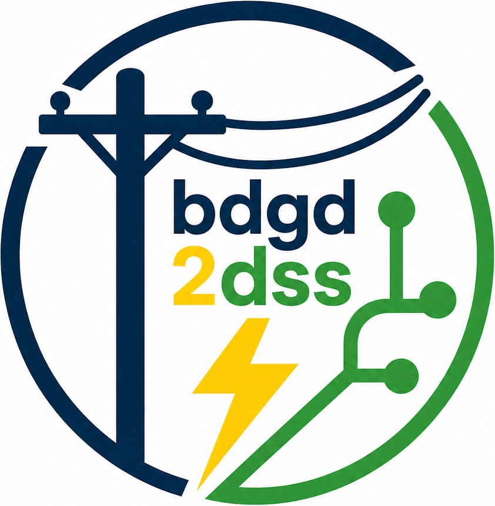

<!-- References (Formatting): -->
<!-- https://portal.revendadesoftware.com.br/manuais/base-de-conhecimento/sintaxe-markdown -->
<!-- https://docs.github.com/en/enterprise-cloud@latest/get-started/writing-on-github/getting-started-with-writing-and-formatting-on-github/basic-writing-and-formatting-syntax -->


<div align="center">
    
</div>

# bdgd2dss 

Conjunto de arquivos referente à biblioteca **bdgd2dss** desenvolvida na linguagem *Python*, que transforma as planilhas oriundas da Base de Dados Geográfica da Distribuidora (BDGD) em arquivos *.dss* para simulação e estudos de alimentadores de sistemas de distribuição de energia elétrica no ambiente *OpenDSS*. A ferramenta em questão foi criada pelo Mestrando em Engenharia Elétrica Arthur Gomes de Souza, que desenvolve pesquisas com o foco em proteção de sistemas elétricos de potência, sob orientação do prof. Dr. Wellington Maycon Santos Bernardes (Universidade Federal de Uberlândia).

Instalação
------------

Para instalar e utilizar a biblioteca **bdgd2dss**, siga os passos abaixo. Recomenda-se iniciar criando um ambiente virtual no terminal do VSCode para isolar as dependências do projeto.

1. Criar o ambiente virtual:

    ```bash
    python -m venv .venv
    ```

2. Ativar o Ambiente Virtual:

    ```bash
    .venv\Scripts\Activate
    ```

3. Instalando a biblioteca:

    ```bash
    pip install bdgd2dss
    ```

4. A seguir, são apresentados os procedimentos para exportação dos dados e a utilização da biblioteca. Serão detalhadas a estrutura da base de dados e as instruções para seu uso em conjunto com a biblioteca.

   
## 1 - Base de Dados Geográfica da Distribuidora - BDGD

A BDGD faz parte integrante do Sistema de Informação Geográfico Regulatório da Distribuição (SIG-R). Em adição, é um modelo geográfico estabelecido com o objetivo de representar de forma simplificada o sistema elétrico real da distribuidora, visando refletir tanto a situação real dos ativos quanto as informações técnicas e comerciais de interesse. De forma a emular a rede elétrica dos agentes envolvidos, a BDGD é estruturada em entidades, modelos abstratos de dados estabelecidos com o objetivo de representar informações importantes, como as perdas estimadas pelos agentes. Cada uma dessas entidades é detalhada em diversos dados, dentre as quais constam aquelas que devem observar a codificação pré-estabelecida pelo Dicionário de Dados da Agência Nacional de Energia Elétrica (ANEEL) (DDA), o qual especifica padrões de dados a serem utilizados na BDGD, visando a normalização das informações. Em relação aos dados cartográficos, eles são disponibilizados em um arquivo *Geodatabase* (*.gdb*), por distribuidora. O Manual de Instruções da BDGD (https://www.gov.br/aneel/pt-br/centrais-de-conteudos/manuais-modelos-e-instrucoes/distribuicao) e o Módulo 10 do PRODIST (https://www.gov.br/aneel/pt-br/centrais-de-conteudos/procedimentos-regulatorios/prodist) contém informações úteis para entender a BDGD, como as entidades disponibilizadas e as definições dos campos [1]. 

Inicialmente, os dados da BDGD são classificados como entidades geográficas e não geográficas, as Tabelas 1 e 2 mostram as camadas que as compõe, respectivamente.


**Tabela 1: Entidades geográficas da BDGD.** 
| id  | Sigla  | Nome                                                       |
|-----|--------|------------------------------------------------------------|
| 22  | ARAT   | Área e Atuação                                             |
| 23  | CONJ   | Conjunto                                                   |
| 24  | PONNOT | Ponto Notável                                              |
| 25  | SSDAT  | Segmento do Sistema de Distribuição de Alta Tensão         |
| 26  | SSDBT  | Segmento do Sistema de Distribuição de Baixa Tensão        |
| 27  | SSDMT  | Segmento do Sistema de Distribuição de Média Tensão        |
| 28  | SUB    | Subestação                                                 |
| 38  | UNCRAT | Unidade Compensadora de Reativo de Alta Tensão             |
| 29  | UNCRBT | Unidade Compensadora de Reativo de Baixa Tensão            |
| 30  | UNCRMT | Unidade Compensadora de Reativo de Média Tensão            |
| 39  | UCAT   | Unidade Consumidora de Alta Tensão                         |
| 40  | UCBT   | Unidade Consumidora de Baixa Tensão                        |
| 41  | UCMT   | Unidade Consumidora de Média Tensão                        |
| 42  | UGAT   | Unidade Geradora de Alta Tensão                            |
| 43  | UGBT   | Unidade Geradora de Baixa Tensão                           |
| 44  | UGMT   | Unidade Geradora de Média Tensão                           |
| 31  | UNREAT | Unidade Reguladora de Alta Tensão                          |
| 32  | UNREMT | Unidade Reguladora de Média Tensão                         |
| 33  | UNSEAT | Unidade seccionadora de Alta Tensão                        |
| 34  | UNSEBT | Unidade seccionadora de Baixa Tensão                       |
| 35  | UNSEMT | Unidade seccionadora de Média Tensão                       |
| 36  | UNTRD  | Unidade Transformadora da Distribuição                     |
| 37  | UNTRS  | Unidade Transformadora da Subestação                       |

**Fonte:** Adaptado de ANEEL (2021) [2].

**Tabela 1: Entidades não geográficas da BDGD.**

| id  | Sigla   | Nome                                          |
|-----|---------|-----------------------------------------------|
| 3   | BE      | Balanço de Energia                            |
| 0   | BAR     | Barramento                                    |
| 1   | BASE    | Base                                          |
| 2   | BAY     | _Bay_                                         |
| 4   | CTAT    | Circuito de Alta Tensão                       |
| 5   | CTMT    | Circuito de Média Tensão                      |
| 6   | EP      | Energia Passante                              |
| 7   | EQCR    | Equipamento Compensador de Reativo            |
| 8   | EQME    | Equipamento Medidor                           |
| 9   | EQRE    | Equipamento Regulador                         |
| 10  | EQSE    | Equipamento Seccionador                       |
| 11  | EQSIAT  | Equipamento do Sistema de Aterramento         |
| 12  | EQTRD   | Equipamento Transformador da Distribuição     |
| 13  | EQTRM   | Equipamento Transformador de Medida           |
| 14  | EQTRS   | Equipamento Transformador da Subestação       |
| 15  | EQTRSX  | Equipamento Transformador do Serviço Auxiliar |
| 16  | INDGER  | Indicadores Gerenciais                        |
| 18  | PNT     | Perdas não Técnicas                           |
| 19  | PT      | Perdas Técnicas                               |
| 17  | PIP     | Ponto de Iluminação Pública                   |
| 20  | RAMLIG  | Ramal de Ligação                              |
| 21  | SEGCON  | Segmento Condutor                             |

**Fonte:** Adaptado de ANEEL (2021) [2].

**Observação:**
Em versões mais antigas da BDGD, as camadas UNTRD, EQTRD, UNTRS e EQTRS eram nomeadas, respectivamente, como UNTRMT (Unidade Transformadora de Média Tensão), EQTRMT (Equipamento Transformador de Média Tensão), UNTRAT (Unidade Transformadora de Alta Tensão) e EQTRAT (Equipamento Transformador de Alta Tensão). Na prática, isso não afeta o processo de modelagem, pois o código reconhece e trata corretamente ambos os formatos.


### 1.2 - *Download* dos arquivos

Para realizar o *download* dos dados de uma distribuidora, basta acessar o link: https://dadosabertos-aneel.opendata.arcgis.com/search?tags=distribuicao [1] e pesquisá-la. Assim sendo, aparecerá mais de um arquivo, correspondente a cada ano. A Figura 1 mostra essa etapa.


**Figura 1: Captura de tela dos dados da BDGD.**

**Fonte:** ANEEL (2024) [1].

Escolhendo o arquivo correspondente, basta baixar como mostra a Figura 2. Alerta-se que essa etapa pode demorar um pouco. 


**Figura 2: Captura de tela de *download* dos dados da BDGD.**

**Fonte:** Adaptado de ANEEL (2024) [1].

## 2 - Tratamento dos arquivos no *QGIS*

### 2.1 - Gerenciador de Fonte de Dados

Após realizado o *download*, será possível trabalhar com os arquivos. Para isso deve-se usar a ferramenta *QGIS* [6], um *software* livre com código-fonte aberto, e multiplataforma. Basicamente é um sistema de informação geográfica (SIG) que permite a visualização, edição e análise de dados georreferenciados. O *download* pode ser feito no *link*: https://qgis.org/download/. Abrindo o *QGIS*, deve-se ir em "Gerenciador da Fonte de Dados" (opção Vetor). Ao selecionar a opção "Diretório", coloca-se a codificação em "Automático", em Tipo escolhe-se a opção "Arquivo aberto GDB", e em Base de Vetores escolhe a pasta do arquivo BDGD baixado e extraído. Finalmente em *LIST_ALL_TABLES* coloca-se em "*YES*" para ser possível uma pré-visualização das camadas disponíveis e selecionar aquelas que desejar visualizar, todas as camadas devem ser selecionadas no campo "Selecionar Todas" e, em seguida, deve-se clicar em "Adicionar Camadas" para prosseguir com a visualização. Essas etapas são mostradas na Figura 3 e 4. 


**Figura 3: Captura de tela do carregamento dos dados no *QGIS*.**

**Fonte:** O autor (2024). 


**Figura 4: Captura de tela do *QGIS* mostrando as camadas da BDGD**

**Fonte:** O Autor (2024).

### 2.2 - Escolha da Zona Específica a Ser Estudada

Para otimizar as simulações e reduzir a quantidade de dados, é recomendável focar em uma área / região / zona específica, em vez de utilizar todos os dados da distribuidora. Por exemplo, pode-se escolher um município, como Uberlândia - Minas Gerais (ou outro à escolha do usuário), e trabalhar apenas com as informações dessa cidade. Para isso, é necessário filtrar as camadas, mantendo apenas os dados relevantes ao município. Uma maneira eficaz de fazer isso é identificar as subestações correspondentes e realizar o filtro em todas as camadas, já que quase todas possuem o atributo referente a uma subestação (SE). Para localizar as subestações e obter o código correspondente, clique com o botão direito na camada das SEs, e selecione a opção "Abrir tabela de atributos". A Figura 5 mostra essa etapa.


**Figura 5: Captura de tela do *QGIS* para abrir a Tabela de Atributos.**

**Fonte:** O Autor (2024).

Com a Tabela de atributos aberta, deve-se localizar as subestações de Uberlândia (município escolhido para a realização dos testes), e salvar os COD_ID delas, como mostra a Figura 6 em sequência.


**Figura 6: Captura de tela do *QGIS* pra identificação das subestações**

**Fonte:** O Autor (2024).

### 2.3 - Filtragem das Camadas e Exportando Planilhas

Com essas informações, será possível acessar todas as camadas e aplicar a filtragem necessária. Para isso, utilizaremos um código em *Python* no *QGIS* para realizar o filtro, gerar um arquivo com as coordenadas e exportar as camadas em arquivos *.csv*, que serão utilizados na modelagem. A Figura 7 ilustra o procedimento para abrir o terminal Python no QGIS. Após abrir o terminal, deve-se selecionar a opção "Abrir Editor".


**Figura 7: Captura de tela do *QGIS* para abrir o terminal *python***

E copiar e colar o código disponível em `exportar_qgis.py` no editor que foi aberto.

Com o script aberto, podemos agora realizar a filtragem das subestações e a exportação dos dados. A Figura 8 apresenta o trecho de código com dois campos configuráveis pelo usuário:

1 - O primeiro define o diretório onde os arquivos exportados serão salvos. Para isso, o usuário deve criar uma pasta chamada Inputs na raiz do projeto e utilizá-la como destino da exportação.

2 - O segundo campo, também destacado na figura, corresponde aos COD_ID das subestações que se deseja exportar, e deve ser preenchido conforme a necessidade da análise.

 Após preencher esses campos, basta executar o script. Vale notar que essa etapa pode demorar, durante a qual o QGIS poderá ficar temporariamente travado; isso é esperado, então é necessário aguardar até a finalização do processo. Por exemplo, nos testes com todas as subestações de Uberlândia, esse procedimento levou cerca de 30 minutos em uma máquina com as seguintes especificações: *Intel Core i5-8500 de 8ª geração @ 3.00GHz, 8 GB de RAM, Windows 10 Pro e SSD NVMe*. Quanto maior a base de dados e o volume de dados a serem exportados, maior será o tempo de execução.


**Figura 8: Captura de tela do *QGIS* do script com o foco nas variáveis de entrada do usuário**

Finalizado o processo de exportação das camadas, deve-se criar um arquivo na raíz do diretório para rodar as simulações, abaixo um exemplo do modelo de código a ser utilizado, recomenda-se salvar como *main.py*.

```bash
import bdgd2dss as b2d
import time


if __name__ == "__main__":
    start_total = time.time()

    # Chamando a função para obter a lista de alimentadores disponíveis nessa BDGD
    feeders_all = b2d.feeders_list()
    #print(f"Alimentadores disponíveis: {feeders_all}") # Exibe a lista de alimentadores disponíveis na BDGD
    
    # Escolhe os alimentadores que deseja simular, pode ser apenas um, vários ou todos, no formato especificado
    feeders = ['ULAU11', 'ULAE714', 'ULAD202', 'ULAD203']  # Exemplo de alimentadores escolhidos
    # Chamando a função para modelar os alimentadores escolhidos usando processamento paralelo
    b2d.feeders_modelling(feeders)

    end_total = time.time()
    print(f"\nTempo total: {end_total - start_total} s") # Exibe o tempo total de execução do script
```


## 3 - Convertendo BDGD em *.dss* usando *Python*

Para realizar a modelagem dos alimentadores utilizando a biblioteca **bdgd2dss**, utiliza-se o arquivo criado com o código acima.

A execução do script inicia-se no bloco *if __name__ == "__main__":*, onde as funções são chamadas em sequência:

1 - Listagem dos alimentadores disponíveis:
A função *b2d.feeders_list()* retorna todos os alimentadores presentes na base de dados exportada. Essa lista é exibida no terminal como referência.
Em seguida, define-se a lista feeders, que contém os identificadores dos alimentadores a serem simulados. Essa lista deve ser informada no formato de strings.

2 - Modelagem dos alimentadores:
A função *b2d.feeders_modelling(feeders)* realiza a modelagem dos alimentadores selecionados, levando em consideração os dados de curto-circuito especificados. O processo de modelagem é executado com paralelismo, garantindo maior desempenho.


> No [vídeo](https://www.youtube.com/watch?v=Zhio9aYRiVM), explicamos a utilização da biblioteca, o que facilita seu entendimento e aplicação.

> Mais detalhes no link: https://github.com/ArthurGS97/bdgd2dss.

> Qualquer inconsistência ou dificuldade na utilização da biblioteca pode contactar os autores.


## [](#header-2)4 - Como citar esta biblioteca:

```Bash
@misc{bdgd2dss,
  author       = {Arthur Gomes de Souza and Wellington Maycon Santos Bernardes},
  title        = {bdgd2dss: Ferramenta para modelagem de alimentadores da BDGD para uso com OpenDSS},
  year         = {2025},
  howpublished = {\url{https://pypi.org/project/bdgd2dss/}},
  note         = {Versão 0.0.5, disponível no PyPI}
}

```

Utilizando esta biblioteca, cite também os seguintes trabalhos: 

>SOUZA, Arthur Gomes de; BERNARDES, Wellington Maycon S. Parametrização de religadores com apoio da base de dados geográfica da distribuidora, OpenDSS e Python. *In*: XXV CONGRESSO BRASILEIRO DE AUTOMÁTICA (CBA), 25., 2024, Rio de Janeiro, RJ, Brazil. Anais... Campinas, SP: Sociedade Brasileira de Automática, 2024. p. 1–7.

>SOUZA, Arthur Gomes de; SANTOS JÚNIOR, Júlio C.; GUEDES, Michele R.; BERNARDES, Wellington Maycon S. Coordinating distribution power system protection in a utility from Uberlândia - MG using a geographic database, QGIS and OpenDSS. *In*: XIV LATIN-AMERICAN CONGRESS ON ELECTRICITY, GENERATION AND TRANSMISSION - CLAGTEE 2022, 14., 2022, Rio de Janeiro, RJ, Brazil. Anais... Guaratinguetá, SP: UNESP, 2022. p. 1-9. 

>SOUZA, Arthur Gomes de; BERNARDES, Wellington Maycon S.; PASSATUTO, Luiz Arthur T. Aquisição de dados topológicos e coordenação de religadores usando as ferramentas de apoio QGIS e OpenDSS. *In*: 15TH IEEE INTERNATIONAL CONFERENCE ON INDUSTRY APPLICATIONS (INDUSCON), 15., 2023, São Bernardo do Campo, Brazil. Anais... Piscataway, New Jersey: IEEE, 2023. p. 607-608. doi: 10.1109/INDUSCON58041.2023.10374830.

>SOUZA, Arthur Gomes de; BERNARDES, Wellington Maycon S. Topological data acquisition and recloser coordination using QGIS and OpenDSS Tools. *In*: XIV CONGRESSO BRASILEIRO DE PLANEJAMENTO ENERGÉTICO (CBPE), 14., 2024, Manaus, AM. Anais... Itajubá, MG: Sociedade Brasileira de Planejamento Energético, 2024. p. 2605–2617.

>PASSATUTO, Luiz Arthur. T.; SOUZA, Arthur Gomes de; BERNARDES, Wellington Maycon S.; FREITAS, L. C. G.; RESENDE, Ênio C. Assignment of Responsibility for Short-Duration Voltage Variation via QGIS, OpenDSS and Python. *In*: 2024 INTERNATIONAL WORKSHOP ON ARTIFICIAL INTELLIGENCE AND MACHINE LEARNING FOR ENERGY TRANSFORMATION (AIE), 2024, Vaasa, Finland. Anais... Vaasa: IEEE, 2024. p. 1-6. doi: 10.1109/AIE61866.2024.10561325.

> SOUZA, Arthur Gomes de; PASSATUTO, Luiz Arthur Tarralo; BERNARDES, Wellington Maycon Santos; FREITAS, Luiz Carlos Gomes; RESENDE, Ênio Costa. Attribution of responsibility for short-duration voltage variations in power distribution systems via QGIS, OpenDSS, and Python language. Institute of Electrical and Electronics Engineers Transactions on Industry Applications, v. 62, n. 2, p. 2377–2391, 2026. DOI: 10.1109/TIA.2025.3618601.


## 🗓️ Histórico de versões

Consulte o [CHANGELOG](https://github.com/ArthurGS97/bdgd2dss/blob/main/CHANGELOG.md) para ver a lista completa de alterações, novas funcionalidades e correções realizadas em cada versão da biblioteca.

> Última versão: **v0.1.0** — publicada em **15/11/2025**.


## Agradecimentos 

O presente trabalho foi realizado com apoio da CAPES - Código de Financiamento 001, da FAPEMIG, do CNPq e do Programa de Pós-Graduação em Engenharia Elétrica (PPGEELT) da Faculdade de Engenharia Elétrica (FEELT) da Universidade Federal de Uberlândia (UFU). As principais dependências encontradas são: bibliotecas py-dss-interface, numpy e pandas.

## Referências

[1] AGÊNCIA NACIONAL DE ENERGIA ELÉTRICA (ANEEL). Dados abertos do Banco de Dados Geográficos de Distribuição - BDGD. Disponível em: [https://dadosabertos-aneel.opendata.arcgis.com/search](https://dadosabertos-aneel.opendata.arcgis.com/search). Acesso em: 29 jul. 2025.

[2] AGÊNCIA NACIONAL DE ENERGIA ELÉTRICA (ANEEL). Manual de Instruções da BDGD. Disponível em: [https://www.gov.br/aneel/pt-br/centrais-de-conteudos/manuais-modelos-e-instrucoes/distribuicao](https://www.gov.br/aneel/pt-br/centrais-de-conteudos/manuais-modelos-e-instrucoes/distribuicao). Acesso em: 16 ago. 2025.

[3] AGÊNCIA NACIONAL DE ENERGIA ELÉTRICA (ANEEL). Procedimentos de Distribuição de Energia Elétrica no Sistema Elétrico Nacional – PRODIST: Módulo 10. Disponível em: [https://www.gov.br/aneel/pt-br/centrais-de-conteudos/procedimentos-regulatorios/prodist](https://www.gov.br/aneel/pt-br/centrais-de-conteudos/procedimentos-regulatorios/prodist). Acesso em: 08 nov. 2025.

[4] MICROSOFT. Visual Studio Code. Disponível em: [https://code.visualstudio.com/download](https://code.visualstudio.com/download). Acesso em: 08 nov. 2025.

[5] PYTHON SOFTWARE FOUNDATION. Python. Disponível em: [https://www.python.org/downloads/](https://www.python.org/downloads/). Acesso em: 08 nov. 2025.

[6] QGIS. QGIS Geographic Information System. Disponível em: [https://qgis.org/download/](https://qgis.org/download/). Acesso em: 08 nov. 2025.


